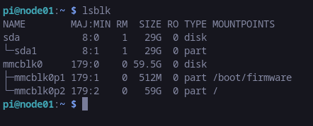
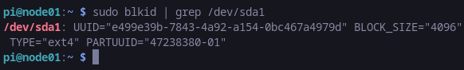
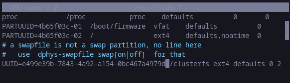
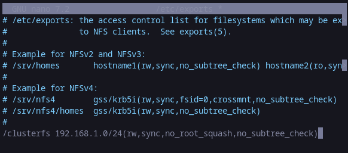
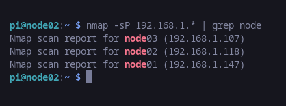
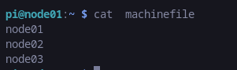
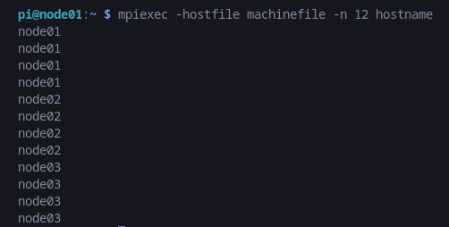

# How to create pi cluster

## 1. install Raspberry pi on all
- all usernames are pi
- host names are node0n
- enable ssh
- connect to network


## get ip addresses

node01 192.168.1.147
node02 192.168.1.118
node03 192.168.1.1077

## remove existing references from known hosts
`gedit ~/.ssh/known_hosts`

## add new entries to hosts file
`sudo nano /etc/hosts`


192.168.1.147 pi-1
192.168.1.118 pi-2
192.168.1.107 pi-3


## login to each node and update the system
`sudo apt-get update`


---

## install packages for the cluster

## time
```
sudo apt install ntpdate -y
sudo reboot
```


## Shared storage
NOTE : below steps are done all on the master node, unless specified


- connect flash drive
- find the drive
    - `lsblk`  


- format the drive
    - `sudo mkfs.ext4 /dev/sda1`

- create and mount directory
    - `sudo mkdir /clusterfs`
    - `sudo chown nobody:nogroup -R /clusterfs`
    - `sudo chmod 777 -R /clusterfs`

- setup automatic mounting
    - `sudo blkid | grep /dev/sda1`  
    UUID="e499e39b-7843-4a92-a154-0bc467a4979d"  
    

    - edit `fstab` (file system table) to mount the drive on boot  
    `sudo nano /etc/fstab`
    
    
    - mount the drive  
    `sudo mount -a`
    `systemctl daemon-reload`

    - Set loose permissions  
    ```
    sudo chown nobody:nogroup -R /clusterfs
    sudo chmod -R 766 /clusterfs
    ```

## Export the NFS Share

- install nfs server
    - `sudo apt install nfs-kernel-server -y`

- export nfs share
    - `sudo nano /etc/exports`  
    

- update nfs kernal server     
    `sudo exportfs -a`

## Mount the NFS Share on the Clients
**NOTE: this is for clients**

- install client
    `sudo apt install nfs-common -y`

- create the mount folder
    ```
    sudo mkdir /clusterfs
    sudo chown nobody:nogroup /clusterfs
    sudo chmod -R 777 /clusterfs
    ```

- setup automatic mounting  
    `sudo nano /etc/fstab`

    - add below line
    ```
    # <master node ip>:/clusterfs    /clusterfs    nfs    defaults   0 0
    192.168.1.147:/clusterfs    /clusterfs    nfs    defaults   0 0
    ```
- mount with it
    ```
    sudo mount -a
    sudo chmod -R 777 /clusterfs
    ```


---
## Configure the Master Node for SLRUM (slurm doesnot work)

**NOTE : instructions are for master, unless specifieds**

- update master as well as nodes `sudo nano /etc/hosts` file with the ip and hostnames

192.168.1.147 node01  
192.168.1.118 node02  
192.168.1.107 node03  


- Install the SLURM Controller Packages
    `sudo apt install slurm-wlm -y`

- slrum config
    ```
    cd /etc/slurm
    sudo cp /usr/share/doc/slurm-client/examples/slurm.conf.simple.gz .
    sudo gzip -d slurm.conf.simple.gz
    sudo mv slurm.conf.simple slurm.conf
    ```
- edit slrum config file  
    `sudo nano /etc/slurm/slurm.conf`

- Set the control machine info

    
    ```
    SlurmctldHost=node01(<ip addr of node01>)
    # e.g.: node01(192.168.1.147)
    ```

- Customize the scheduler algorithm (optional)
    ```
    SelectType=select/cons_res
    SelectTypeParameters=CR_Core
    ```

- Set the cluster name
    ```
    ClusterName=picluster
    ```

- Add the nodes
    ```
    # NodeName=node01 NodeAddr=<ip addr node01> CPUs=4 State=UNKNOWN
    # NodeName=node02 NodeAddr=<ip addr node02> CPUs=4 State=UNKNOWN
    # NodeName=node03 NodeAddr=<ip addr node03> CPUs=4 State=UNKNOWN
    

    NodeName=node01 NodeAddr=192.168.1.147 CPUs=4 State=UNKNOWN
    NodeName=node02 NodeAddr=192.168.1.118 CPUs=4 State=UNKNOWN
    NodeName=node03 NodeAddr=192.168.1.107 CPUs=4 State=UNKNOWN
    ```
- create a partition
    ```
    PartitionName=mycluster Nodes=node[02-03] Default=YES MaxTime=INFINITE State=UP
    ```

- Configure cgroups Support   
    `sudo nano /etc/slurm/cgroup.conf`
```
CgroupMountpoint="/sys/fs/cgroup"
CgroupAutomount=yes
CgroupReleaseAgentDir="/etc/slurm/cgroup"
AllowedDevicesFile="/etc/slurm/cgroup_allowed_devices_file.conf"
ConstrainCores=no
TaskAffinity=no
ConstrainRAMSpace=yes
ConstrainSwapSpace=no
ConstrainDevices=no
AllowedRamSpace=100
AllowedSwapSpace=0
MaxRAMPercent=100
MaxSwapPercent=100
MinRAMSpace=30
```

- whitelist system devices by creating the below file   
`sudo nano /etc/slurm/cgroup_allowed_devices_file.conf`

```
/dev/null
/dev/urandom
/dev/zero
/dev/sda*
/dev/cpu/*/*
/dev/pts/*
/clusterfs*
```

### Copy the Configuration Files to Shared Storage

```
sudo cp slurm.conf cgroup.conf cgroup_allowed_devices_file.conf /clusterfs
sudo cp /etc/munge/munge.key /clusterfs
```

### Enable and Start SLURM Control Services

```
sudo systemctl enable munge
sudo systemctl start munge
```

### enable and start the SLURM daemon
```
sudo systemctl enable slurmd
sudo systemctl start slurmd
```

### enable and start the control daemon
```
sudo systemctl enable slurmctld
sudo systemctl start slurmctld
```

## Configure the Compute Nodes

**NOTE : on nodes, unless specified**

- Install the SLURM Client  
`sudo apt install slurmd slurm-client -y`

- Copy the Configuration Files
```
sudo cp /clusterfs/munge.key /etc/munge/munge.key
sudo cp /clusterfs/slurm.conf /etc/slurm/slurm.conf
sudo cp /clusterfs/cgroup* /etc/slurm
```

- Enable and start Munge.  
```
sudo systemctl enable munge
sudo systemctl start munge
```

- test munge on  the clients (dont unmunge)  
`ssh node01 munge -n`

- Start the SLURM Daemon

```
sudo systemctl enable slurmd
sudo systemctl start slurmd
```

- reboot
`sudo reboot`


- Test SLURM (on master and all nodes)

`sinfo`

----

***SLRUM does not work***

---

## MPICH

- install on all
`sudo apt install mpich -y`

- test
```
mpiexec -n 1 date
mpiexec -n 4 python test.py 
```

---

## login without password with by exchanging ssh keys

- install nmap  
    `sudo apt install nmap`

- to fing ip addresses  
    `nmap -sP 192.168.1.* | grep node`  
    

- On the master, create the SSH key with:  
    `ssh-keygen -t rsa`

- copy it to all other nodes (example)  
`scp /home/pi/.ssh/id_rsa.pub pi@192.168.1.18:/home/pi/master.pub`

- append the public key to the known hosts  
    `cat master.pub >> cat master.pub >> ~/.ssh/authorized_keys`
- `exit`
- `ssh pi@node01`

- create machinefile file with ip addresses and add nodes to it  
    `nano machinefile`   
    

- example command for mpich   
    `mpiexec -hostfile machinefile -n 8 hostname`  
    
---

## References
- https://glmdev.medium.com/building-a-raspberry-pi-cluster-784f0df9afbd
- https://endtoendpaper.com/2020/02/04/five-pi-raspberry-pi-cluster/
- https://raspberrytips.com/raspberry-pi-cluster/
- https://www.mpich.org/static/downloads/4.1.2/mpich-4.1.2-installguide.pdf

